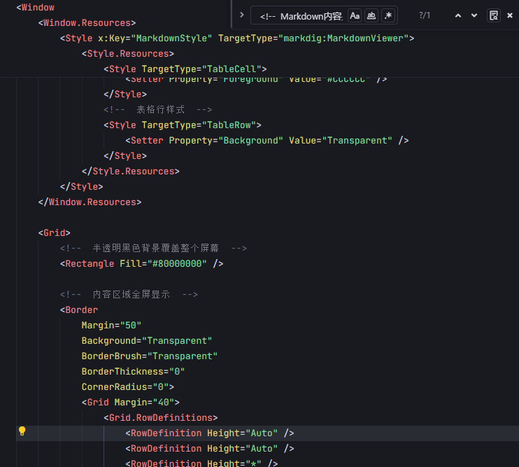

# 3ds Max 动画工具详解

## 核心动画工具

### 1. 自动关键帧 (Auto Key)

**位置**: 时间控制区域的红色圆点按钮
**功能**: 自动在对象属性发生变化时创建关键帧
**使用方法**:
- 点击激活（按钮变红）
- 移动时间滑块
- 修改对象属性
- 系统自动创建关键帧

### 2. 设置关键帧 (Set Key)
**位置**: 自动关键帧按钮旁边的钥匙图标
**功能**: 手动为选定对象的当前属性设置关键帧
**快捷键**: K
**优势**: 精确控制关键帧的创建时机

### 3. 时间配置 (Time Configuration)
**访问方式**: 右键点击时间滑块区域
**设置项目**:
- 帧率 (Frame Rate)
- 动画长度 (Animation Length)
- 时间显示格式
- 播放范围

## 曲线编辑器 (Curve Editor)

### 访问方式
- 菜单: Graph Editors > Track View - Curve Editor
- 快捷键: F12

### 主要功能

#### 关键帧编辑
- **移动关键帧**: 直接拖拽关键帧点
- **调整数值**: 精确输入关键帧数值
- **复制粘贴**: Ctrl+C / Ctrl+V 复制关键帧
- **删除关键帧**: 选中后按Delete键

#### 插值类型
1. **线性 (Linear)**: 直线插值，运动匀速
2. **平滑 (Smooth)**: 贝塞尔曲线，平滑过渡
3. **快进快出 (Fast In/Out)**: 加速减速效果
4. **慢进慢出 (Slow In/Out)**: 缓慢开始结束

#### 切线控制
- **自动切线**: 系统自动计算最佳切线
- **自定义切线**: 手动调整切线方向和长度
- **线性切线**: 创建尖锐的转折点
- **平滑切线**: 创建平滑的过渡

## 动画约束 (Animation Constraints)

### 位置约束 (Position Constraint)
**用途**: 让对象跟随其他对象的位置
**应用场景**: 相机跟踪、对象绑定

### 方向约束 (Orientation Constraint)
**用途**: 让对象始终朝向目标对象
**应用场景**: 角色视线跟踪、炮塔瞄准

### 路径约束 (Path Constraint)
**用途**: 让对象沿着样条线路径运动
**设置步骤**:
1. 创建样条线路径
2. 选择要约束的对象
3. 应用路径约束
4. 指定路径样条线
5. 调整路径参数

### 注视约束 (LookAt Constraint)
**用途**: 让对象始终注视目标
**常用于**: 相机控制、角色动画

## 动画控制器 (Animation Controllers)

### 位置控制器
- **贝塞尔位置**: 平滑的位置动画
- **线性位置**: 直线运动
- **TCB位置**: 张力、连续性、偏移控制

### 旋转控制器
- **欧拉XYZ**: 分别控制X、Y、Z轴旋转
- **TCB旋转**: 平滑旋转插值
- **四元数**: 避免万向锁问题

### 缩放控制器
- **贝塞尔缩放**: 平滑缩放动画
- **线性缩放**: 匀速缩放

## 动画图层 (Animation Layers)

### 功能特点
- **非破坏性编辑**: 不影响原始动画
- **图层混合**: 多个动画图层叠加
- **权重控制**: 调整图层影响强度

### 使用流程
1. 创建基础动画
2. 添加新的动画图层
3. 在新图层上添加修改
4. 调整图层权重和混合模式

## 动画工具栏快捷操作

### 播放控制
| 按钮 | 功能 | 快捷键 |
|------|------|--------|
| ▶️ | 播放/暂停 | 空格键 |
| ⏹️ | 停止 | Ctrl+. |
| ⏮️ | 到开始帧 | Home |
| ⏭️ | 到结束帧 | End |
| ⏪ | 上一帧 | , |
| ⏩ | 下一帧 | . |

### 关键帧导航
- **上一个关键帧**: Ctrl+, 
- **下一个关键帧**: Ctrl+.
- **选择所有关键帧**: Ctrl+A（在曲线编辑器中）

## 高级动画工具

### 动画混合器 (Animation Mixer)
**用途**: 混合和管理多个动画片段
**功能**:
- 动画片段管理
- 过渡效果设置
- 循环播放控制

### 表达式控制器 (Expression Controller)
**用途**: 使用数学表达式驱动动画
**示例**:
```
// 简单的摆动动画
sin(T*2*pi) * 50

// 基于其他对象的位置
$Box01.pos.x * 2
```

### 脚本控制器 (Script Controller)
**用途**: 使用MAXScript代码控制动画
**优势**: 复杂逻辑控制、程序化动画

## 性能优化工具

### 动画压缩
- **减少关键帧**: 删除冗余关键帧
- **优化曲线**: 简化动画曲线
- **采样频率**: 调整关键帧密度

### 预览优化
- **自适应降级**: 自动降低预览质量
- **代理对象**: 使用简化模型预览
- **视口配置**: 优化视口显示设置

## 故障排除

### 常见问题
1. **动画不平滑**: 检查插值类型和切线设置
2. **关键帧丢失**: 确认自动关键帧状态
3. **约束失效**: 检查约束目标对象
4. **性能问题**: 优化场景复杂度

### 调试技巧
- 使用曲线编辑器检查动画曲线
- 逐帧播放检查问题帧
- 临时隐藏复杂对象
- 使用动画图层隔离问题