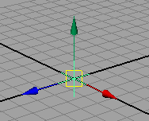
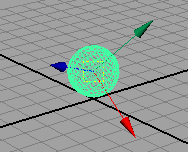
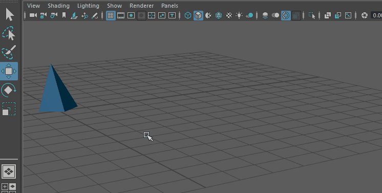

# 世界空间、对象空间和局部空间

3D 位置和变换存在于名为空间的坐标系中。

世界空间是整个场景的坐标系。它的原点位于场景的中心。视图窗口中的栅格显示了世界空间轴。

对象空间是来自对象视点的坐标系。对象空间的原点位于对象的枢轴点处，而且其轴随对象旋转。

局部空间类似于对象空间，但是它使用对象层中对象父节点的原点和轴。当对象是变换组的一部分，而对象本身并未变换时，该方法非常有用。

## 从世界空间更改为对象空间

通过双击“变换工具”(Transformation Tools)，然后在显示的“工具设置”(Tool Settings)中的“轴方向”(Axis Orientation)菜单中更改设置，从而在空间（如世界空间和对象空间）之间切换。

