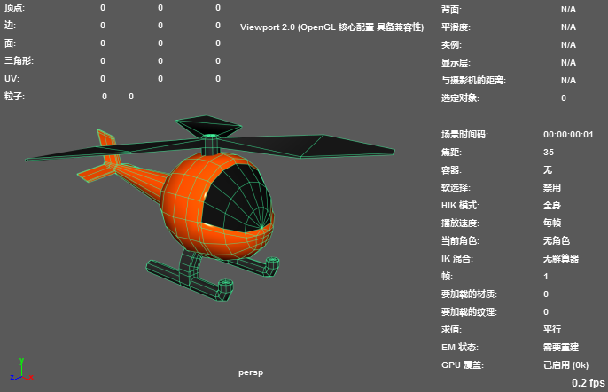

您可以使用平视显示仪 (HUD) 选项在视图面板中显示所有类型的场景信息，例如，当前帧、帧速率、视图轴、原点轴、多边形计数等。

若要在 HUD 中创建或编辑自定义读数，请使用[创建自定义平视显示仪读数](https://help.autodesk.com/view/MAYAUL/2025/CHS/?guid=GUID-5C6AFD87-82DE-4C4B-B3F1-DB4A0C3B59C4)中所述的 headsUpDisplay MEL 命令。

| 目标                                                   | 操作                                                         |
| :----------------------------------------------------- | :----------------------------------------------------------- |
| 在所有视图面板中显示或隐藏 HUD 项目。                  | 从“显示 > 平视显示仪”(Display > Heads Up Display)子菜单中选择项目 - 请参见[平视显示仪 (HUD) 选项](https://help.autodesk.com/view/MAYAUL/2025/CHS/?guid=GUID-0E9D9594-6664-4B69-B944-8B69E9551415)。**提示：** 按住 **Ctrl** 键可使此菜单保持打开状态，*此时可选择多个选项*。（从菜单移走鼠标时，它将关闭。）如果希望以单独的窗口形式显示此菜单，以便可以开启和关闭设置，请单击顶部的撕下线。（有关示例，请参见[菜单和菜单集](https://help.autodesk.com/view/MAYAUL/2025/CHS/?guid=GUID-D90A2BDB-FD05-4528-8A95-C33A02D15129)主题中的**“撕下”(Tear Off)菜单**。） |
| 逐视图面板显示或隐藏 HUD。                             | 在视图面板中，切换“显示 > HUD”(Show > HUD)选项。这将同时显示或隐藏所有 HUD 项目。 |
| 更改 HUD 文本的颜色                                    | 选择“窗口 > 设置/首选项 > 颜色设置”(Windows > Settings/Preferences > Color Settings)以打开“颜色设置”(Color Settings)窗口。展开“常规”(General)选项卡上的“平视显示仪”(Heads Up Display)部分，然后设置每个选项的颜色。 |
| 设置视图轴（视图面板的左下角）和原点轴的默认显示首选项 | 选择“窗口 > 设置/首选项 > 首选项”(Windows > Settings/Preferences > Preferences)以打开“首选项”(Preferences)窗口，选择“显示”(Display)，然后切换“轴 > 视图轴”(Axes > View axis)和“原点轴”(Origin axis)对应的选项。 |