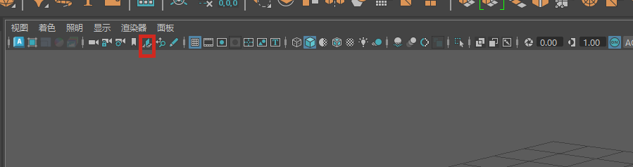
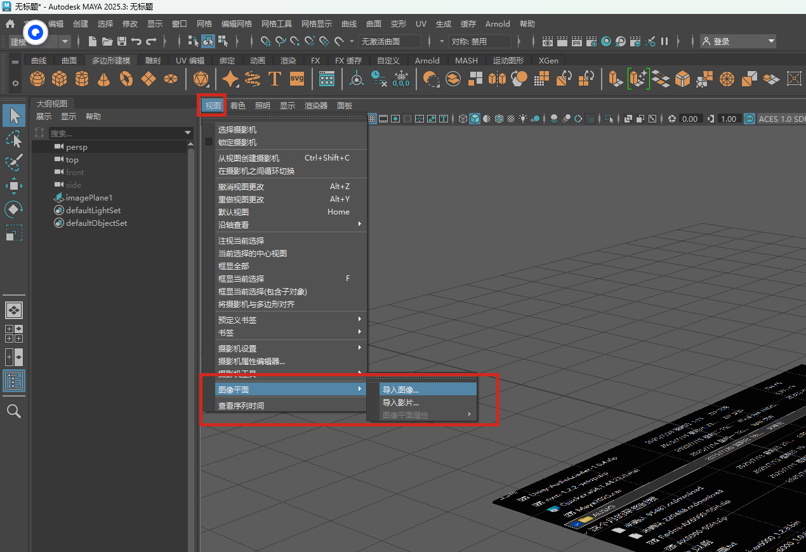
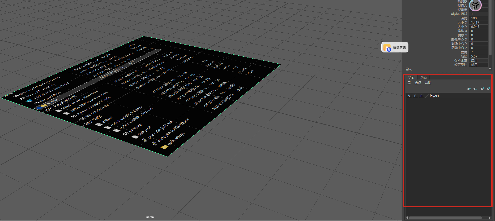
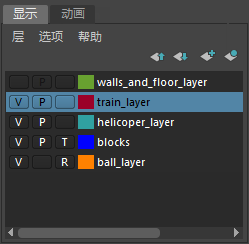
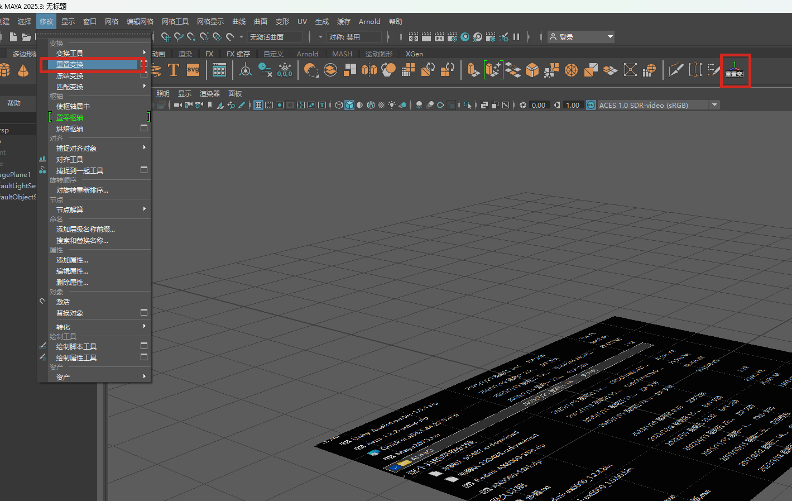
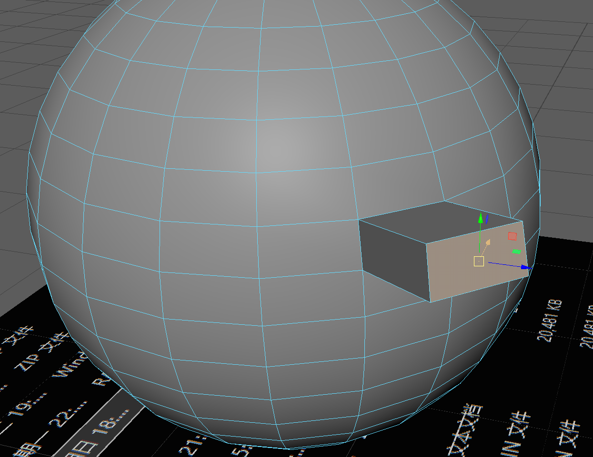
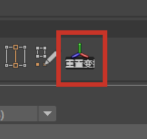
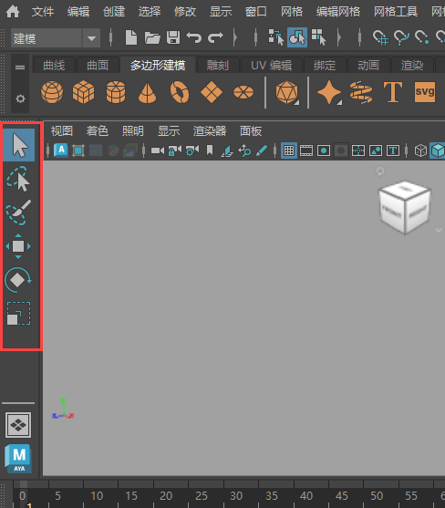
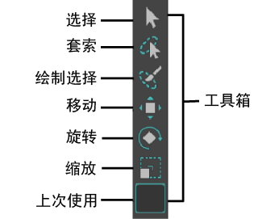

### 添加参考图

### 添加导入层

默认情况下，层编辑器显示在[通道盒(Channel Box)](https://help.autodesk.com/view/MAYAUL/2025/CHS/?guid=GUID-4C954FB2-8B6A-4BBD-9695-DF432616D0D2)面板的底部。单击“通道盒/层编辑器”(Channel Box/Layer Editor)图标可将其打开。

“层编辑器”(Layer Editor)包含许多选项卡，支持您显示两个不同的编辑器来处理不同类型的层。

- [显示层](https://help.autodesk.com/view/MAYAUL/2025/CHS/?guid=GUID-1A86D19F-8AF9-4D0E-AF05-EE9033E49EC5)用于组织和管理场景中的对象，例如，用于设置可见性和可选性的层。
- [动画层](https://help.autodesk.com/view/MAYAUL/2025/CHS/?guid=GUID-5C202CB8-EB3C-4ADE-B203-5F93A9FD9104)用于融合、锁定或禁用动画的多个级别。

在所有情况下，都有一个默认层，对象在创建后最初放置在该层。

如果在“首选项”(Preferences)窗口（选择“窗口 > 设置/首选项 > 首选项”(Windows > Settings/Preferences > Preferences)，然后选择“UI 元素”(UI Elements)）中禁用“在通道盒内显示层编辑器”(Show Layer Editor within Channel Box)选项，则可独立显示“层编辑器”(Layer Editor)。

然后，单击状态行中的“层编辑器”(Layer Editor)图标将其打开。

### 添加命令菜单到面板

按住Ctrl+Shift 点击将会添加到上册面板上

### 修改对齐坐标点

选中面，按下d键修改锚点，在按下Ctrl 选择对齐 鼠标左键点击对其参考的点/面

### 重置变换

重置变换-> 重新回归到0,0,0点

### 工具箱

默认情况下，“工具箱”(Tool Box)将显示在 Maya 界面的左侧。请参见[界面概述](https://help.autodesk.com/view/MAYAUL/2025/CHS/?guid=GUID-F4FCE554-1FA5-447A-8835-63EB43D2690B)。它包含可供在 Maya 中进行操作的最常用工具。

Maya 界面左侧的“工具箱”(Tool Box)

**注：** 如果未看到“工具箱”(Toolbox)（或界面的其他区域），请转到主菜单中的“窗口 > UI 元素”(Windows > UI Elements)，然后选中缺少项旁边的复选框。您还可以重置[工作区](https://help.autodesk.com/view/MAYAUL/2025/CHS/?guid=GUID-0384C282-3CA1-4587-9775-F7164D3F6980)，或选择包含“工具箱”(Toolbox)的工作区，例如“常规”(General)。

以下热键适用于工具箱中的工具。您可以在[热键编辑器](https://help.autodesk.com/view/MAYAUL/2025/CHS/?guid=GUID-36D24C0F-19E4-411E-8CA9-DB7B64C3E6EA)中将快捷键重新指定给不同的键。

| 工具名称     | 图标                                                         | 快捷方式/热键                                                |
| :----------- | :----------------------------------------------------------- | :----------------------------------------------------------- |
| 选择(Select) |  | q（“选择遮罩”(Selection Mask)标记菜单：按住 q 键并单击）     |
| 套索         |  | 未指定热键。若要为此工具指定键盘快捷方式，请参见[热键编辑器](https://help.autodesk.com/view/MAYAUL/2025/CHS/?guid=GUID-36D24C0F-19E4-411E-8CA9-DB7B64C3E6EA)。 |
| 绘制选择     |  | 未指定热键。若要为此工具指定键盘快捷方式，请参见[热键编辑器](https://help.autodesk.com/view/MAYAUL/2025/CHS/?guid=GUID-36D24C0F-19E4-411E-8CA9-DB7B64C3E6EA)。 |
| 移动         |  | w（“移动工具”(Move Tool)标记菜单：按住 w 键并单击）          |
| 旋转(Rotate) |  | e（“旋转工具”(Rotate Tool)标记菜单：按住 e 键并单击）        |
| 缩放(Scale)  |  | r（“缩放工具”(Scale Tool)标记菜单：按住 r 键并单击）         |
| 上次使用     |                                                              | y（不属于选择、移动、旋转或缩放的最后使用的工具）            |