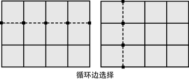
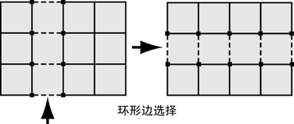
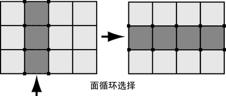
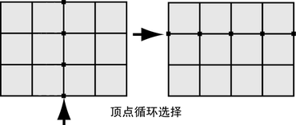

# 多边形组件循环和环形

通过组件循环和环形，可以选择网格上的多个组件，而无需单独选择每个组件。

## 循环边

循环边是由其共享顶点按顺序连接的多边形边的路径。例如，如果选择球体上的一条水平边，循环边选择将尝试沿球体上的相同纬度线选择所有水平边。请参见[选择循环边](https://help.autodesk.com/view/MAYAUL/2025/CHS/?guid=GUID-EB713BC6-3402-4BE6-8475-BB9FF53439AA)。

可以选择：

- 完全穿越多边形网格的循环边
- 部分穿越多边形网格的循环边
- 多边形网格上的多方向循环边路径

## 环形边

环形边是由多边形边的共享面按顺序连接的多边形边的路径。例如，如果在球体上选择一条垂直边，请通过选择与选定边相邻的各连续边，环选择选择球体上相同纬度线上的所有垂直边。请参见[选择环形边](https://help.autodesk.com/view/MAYAUL/2025/CHS/?guid=GUID-814BADD4-9D5A-4B01-ACB1-CBAD8D1026E4)。

您可以选择：

- 完全穿越多边形网格的环形边（闭合环）
- 部分穿越多边形网格的环形边（开放环）
- 多边形网格上的多向路径

## 面循环

面循环是多边形面按其共享边顺序连接的路径。例如，如果选择球体的一个面，通过选择与选定面相邻的每个连续面，循环选择可以选择沿球体同一条纬度线和经度线的所有面。请参见[选择面循环](https://help.autodesk.com/view/MAYAUL/2025/CHS/?guid=GUID-5F653F7D-DF69-4277-A423-2BE46DC1A5E8)。

可以选择：

- 完全覆盖多边形网格的面循环（闭合循环）
- 部分覆盖多边形网格的面循环（开放循环）

## 顶点循环

*顶点循环*是通过共享边按顺序连接的顶点路径。例如，选择球体上的一个顶点，则循环选择将通过选择每个与选定面相邻的连续顶点，选择球体相同纬度线或经度线上的所有顶点。请参见[选择顶点循环](https://help.autodesk.com/view/MAYAUL/2025/CHS/?guid=GUID-C8C48B82-85C3-427E-8CE5-E99942FACE0D)。

您可以选择：

- 完全穿越多边形网格的顶点循环（闭合循环）
- 部分穿越多边形网格的顶点循环（开放循环）