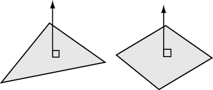

法线是与多边形的曲面垂直的理论线。在 Maya 中，法线用于确定多边形面的方向（面法线），或确定面的边着色后彼此之间如何可视化显示（顶点法线）。

## 面法线

多边形某个面的正面使用称为多边形法线的向量以图形表示。

面周围的顶点顺序决定了面的方向（无论多边形的一侧是正面还是背面）。例如，如果以顺时针方向放置顶点，则面法线指向下方。如果以逆时针方向放置顶点，则面法线指向上方。请参见[创建多边形网格](https://help.autodesk.com/view/MAYAUL/2025/CHS/?guid=GUID-AA992773-5F7D-4D77-AF55-11211A294A64)。

尽管在默认情况下，为使您可以从背面看到所有多边形，Maya 会自动使其具有双面，但由于从技术上讲多边形只能从前面可见，因此这点很重要。可以对网格禁用该双面行为。

着色或渲染多边形时，法线决定了如何从曲面反射灯光及由此产生的着色。

## 顶点法线

顶点法线确定多边形面之间的可视化柔和度或硬度。与面法线不同的是，它们不是多边形所固有的，而是反映 Maya 如何在平滑着色处理模式下渲染多边形。

顶点法线显示为从顶点投影的线，共享该顶点的每个面都有一条顶点法线。

- 特定顶点的法线均指向同一方向时（称为软顶点法线或共享顶点法线），平滑着色处理模式下面与面之间会包含软边过渡。

  

- 顶点法线所指的方向与其面相同时（称为硬顶点法线），面与面之间是硬过渡，此时会创建面状外观。

  

操纵顶点法线是在不使用附加几何体的情况下软化或硬化边外观（折痕）的最简便方法。通过使用“软化/硬化边”(Soften/Harden Edge)命令，或者通过使用[顶点法线编辑工具(Vertex Normal Edit Tool)](https://help.autodesk.com/view/MAYAUL/2025/CHS/?guid=GUID-2B0FD45A-6EE0-47BE-B243-3C802D38D9A7)（“网格显示 > 顶点法线编辑工具”(Mesh Display > Vertex Normal Edit Tool)）手动操纵顶点法线，可自动执行此操作。如果手动编辑多边形网格的顶点法线，则会将其锁定或冻结。解锁先前锁定的顶点法线时，Maya 会根据面的默认法线计算自动重新计算其顶点法线。