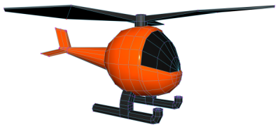
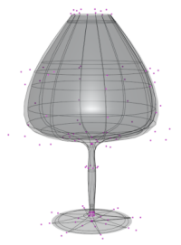
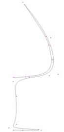
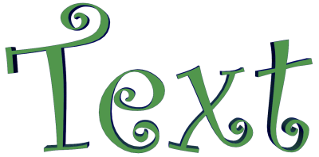
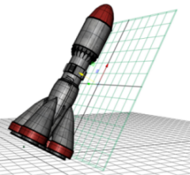
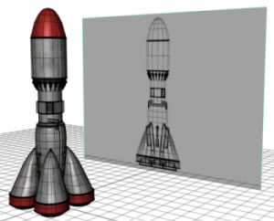
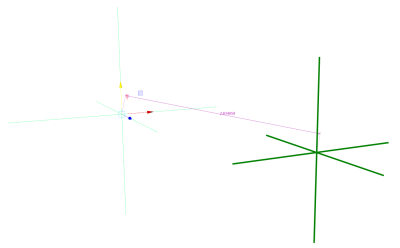

Maya 有多种不同类型的对象可供您用于不同目的。其中大多数用于为对象建模，但也有一些其他“辅助对象”可供您在场景中构建不同元素。

**注：** 若要快速开始为多边形和 NURBS 基本体建模并绘制曲线，请参见[创建基本 3D 对象和曲线](https://help.autodesk.com/view/MAYAUL/2025/CHS/?guid=GUID-BCE77B61-41D6-4599-89F4-B1C88679BC80)。

| 多边形对象(Polygon objects)          |  | 多边形对象是由面、边和顶点组成的 3D 几何对象，通常称为“多边形网格”。多边形网格广泛用于为游戏、电影和 Internet 创建的多种 3D 模型。有关多边形网格的定义及其所有创建和编辑方法的详细信息，请参见[多边形建模](https://help.autodesk.com/view/MAYAUL/2025/CHS/?guid=GUID-7941F97A-36E8-47FE-95D1-71412A3B3017)。 |
| ------------------------------------ | ------------------------------------------------------------ | ------------------------------------------------------------ |
| NURBS（非均匀有理 B 样条线）曲面对象 |  | NURBS 曲面对象是由 U 向和 V 向曲线定义的面片组成的 3D 几何对象。曲面插补在控制点之间，从而生成平滑形状。NURBS 十分平滑，对于构建有机 3D 形状十分有用，且主要用于工业设计、动画和科学可视化领域。有关 NURBS 的定义及其所有创建和编辑方法的详细信息，请参见 [NURBS 建模](https://help.autodesk.com/view/MAYAUL/2025/CHS/?guid=GUID-735A0B9A-2180-4FB8-9A7B-68F21F306E97)和 [NURBS 概述](https://help.autodesk.com/view/MAYAUL/2025/CHS/?guid=GUID-5EC05798-3F28-4AD2-8154-36BC444A4DC9)。 |
| NURBS 曲线(NURBS curves)             |  | 曲线用于构建对象或用作场景中的其他元素。可以使用不同的方法从曲线创建 3D 对象，或者将其用于动画的运动路径等内容或用于控制变形。有关如何绘制曲线以及通过其他方式创建曲线的详细信息，请参见[创建 NURBS 曲线](https://help.autodesk.com/view/MAYAUL/2025/CHS/?guid=GUID-DF4D96B8-15B6-4829-B206-D00F49835C3B)。 |
| 文本(Text)                           |  | 文本是指您可以通过使用“类型”(Type)工具创建（选择“创建 > 类型”(Create > Type)）的 3D 文本。这可用于创建品牌宣传、飞行标识、标题序列以及其他需要文字的项目。有关详细信息，请参见[创建多边形文本](https://help.autodesk.com/view/MAYAUL/2025/CHS/?guid=GUID-5715F385-F27A-49E0-A624-CB376B669EDC)。 |
| 构造平面(Construction planes)        |  | 构造平面是简单的平面，有助于更轻松地创建方向不沿 XYZ 轴的对象 - 选择“创建 > 构造平面”(Create > Construction Plane)。通过“激活”(Make Live)工具将构造平面设置为“活动”状态（请参见[设置激活的曲面](https://help.autodesk.com/view/MAYAUL/2025/CHS/?guid=GUID-EBF1E652-4DDD-423F-B42E-3BF85AE46A5D)）时，所有图形均会锁定到该平面。 |
| 图像平面(Image Planes)               |  | 图像平面是可供“投影”不同图像的 2D 平面（栅格），通常在为对象建模时用于参考图像，或者用作场景的背景图像。您既可以创建未附加到摄影机的自由图像平面（选择“创建 > 自由图像平面”(Create > Free Image Plane)），也可以创建附加到透视摄影机的图像平面（在透视视图面板中选择“视图 > 图像平面 > 导入图像”(View > Image Plane > Import Image)）。有关详细信息，请参见[图像平面](https://help.autodesk.com/view/MAYAUL/2025/CHS/?guid=GUID-E2490B87-087E-476A-9C1D-A917D009001A)。 |
| 定位器(Locators)                     |  | 定位器类似图标，有时称为空对象，仅表示空间位置且不进行渲染 - 选择“创建 > 定位器”(Create > Locator)。尽管定位器听起来很普通，但却是非常有用的辅助对象，例如，它可用来为角色关节、将其他对象约束到的对象建立父子关系或测量两点之间的距离。 |