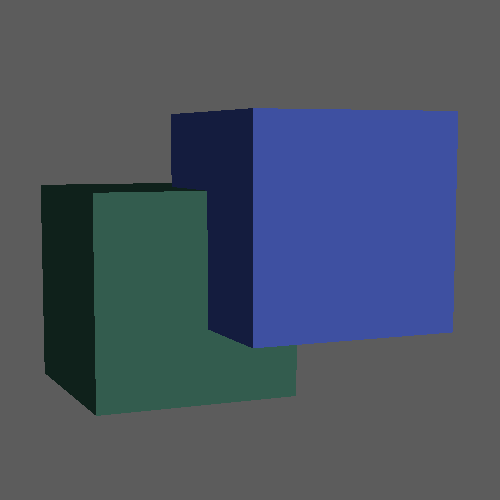
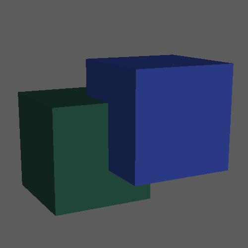
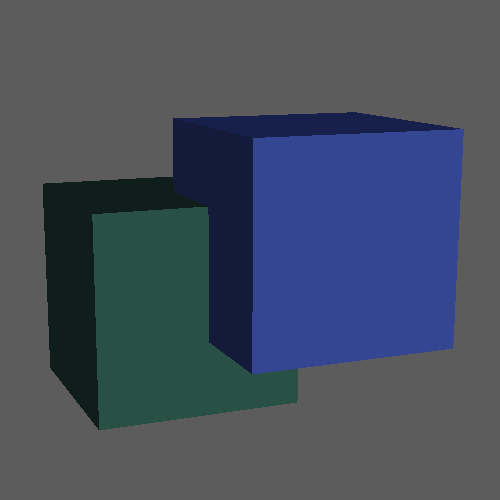
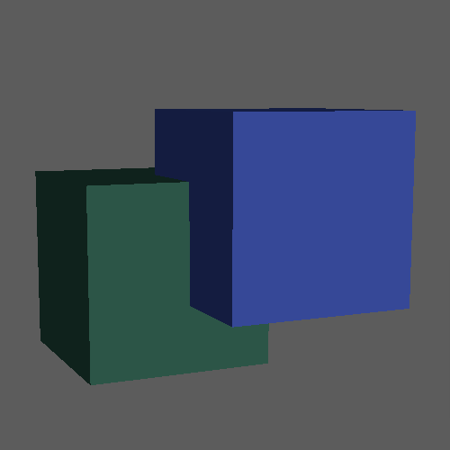
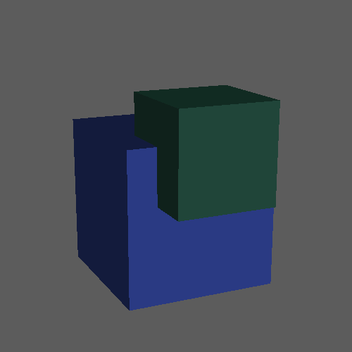
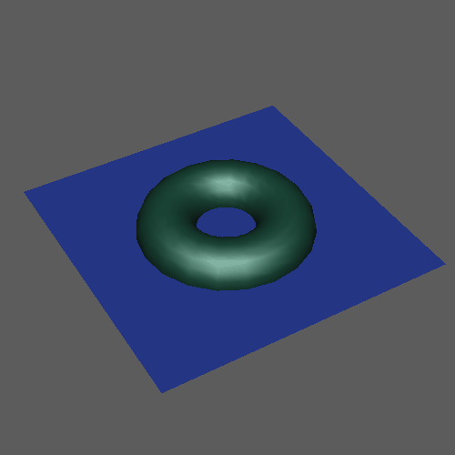
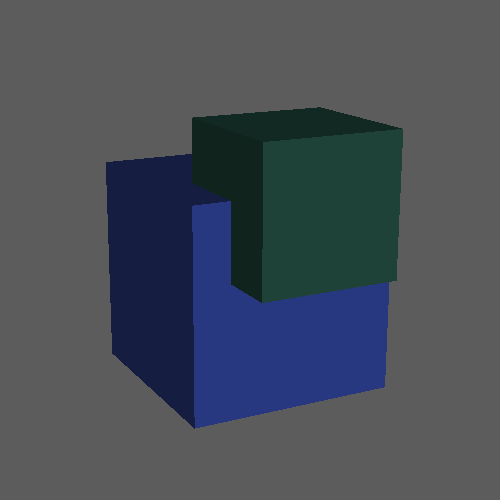

# 布尔运算

若要使用布尔运算，请执行下列操作之一：

- 选择“网格 > 布尔”(Mesh > Booleans)，然后选择布尔运算。
- 在“多边形建模”(Poly Modeling)工具架中的  上单击鼠标右键，然后选择一种布尔运算。
- 在“建模工具包”(Modeling Toolkit)中的  上单击鼠标右键，然后选择一种布尔运算。
- **注：** 默认情况下，单击“多边形建模”(Poly Modeling)工具架或“建模工具包”(Modeling Toolkit)中的按钮将执行“差集(A-B)”(Difference (A-B))运算。
- **提示：** 为任何布尔命令指定热键，以快速执行布尔运算，而不会丢失“视口”(Viewport)中的焦点。请参见[将热键指定给命令](https://help.autodesk.com/view/MAYAUL/2025/CHS/?guid=GUID-92F8EBD9-A658-4A1E-9D85-571B5B809F52)。

可以使用以下布尔运算创建新的复杂形状。

- 并集

  将对象熔合在一起。

  

- 差集(A-B)(Difference (A-B))

  从第一个选定对象 (A) 中减去第二个选定对象 (B)

  。

- 差集(B-A)(Difference (B-A))从第二个选定对象 (B) 中减去第一个选定对象 (A)。

  

- 交集

  删除不在其他输入对象内部的任何曲面，从而熔合其余的内部曲面。

  

- 切片(Slice)

  在输入对象相交处拆分第一个选定对象上的面，从而创建单独的壳。

  

- 打洞(Hole Punch)

  移除第一个选定对象中位于任何其他输入对象内部的任何曲面，从而留下一个开放网格。

- 剪辑镜头出点(Cut Out)

  移除第一个选定对象中位于任何其他输入对象外部的任何曲面，从而留下一个开放网格。

- 分割边(Split Edges)

  在第一个选定网格上沿输入对象的交点插入新边。

  