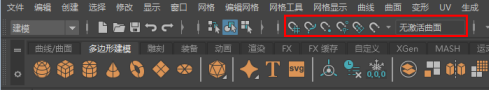

使用“移动工具”(Move Tool)和各种创建工具时，可以捕捉到场景中的现有对象。

若要捕捉移动，请在要捕捉到的对象上单击鼠标中键。若要取消激活捕捉行为，请再次单击“状态行”(Status Line)图标。

| 捕捉的目标位置                 | 按键 | 或在状态行（工具栏）上启用该图标                             |
| :----------------------------- | :--- | :----------------------------------------------------------- |
| 栅格交点                       | x    |  |
| 曲线                           | c    |  |
| CV、顶点或轴                   | v    |  |
| 几何体中心                     |      |  |
| 视图平面                       |      |  |
| 曲面                           |      |  |
| **再次单击该图标可关闭捕捉。** |      |                                                              |

**注：** 如果已启用捕捉并在“移动”(Move)操纵器上拖动箭头（相对于中心），则操纵器将沿该轴捕捉到第一个可用的点。