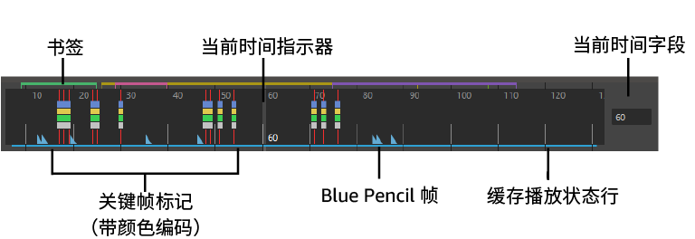
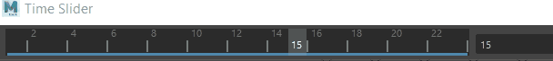
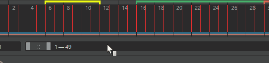
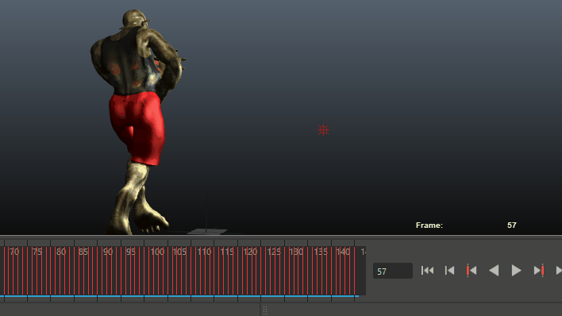
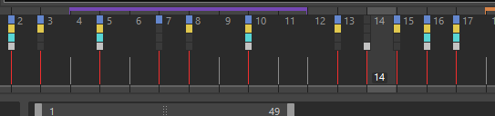
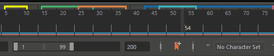
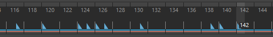
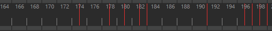

# 时间滑块(Time Slider)

“时间滑块”(Time Slider)用于控制播放范围、关键帧和播放范围内的受控关键点。

**提示：**

- 在“时间滑块”(Time Slider)上**单击鼠标右键**以访问[“动画控件”(Animation controls)菜单](https://help.autodesk.com/view/MAYAUL/2025/CHS/?guid=GUID-4A45C257-9E4D-4C63-A181-B2F94EA0C8B4)，该菜单包含用于“时间滑块”(Time Slider)的许多元素的选项。
- 通过将光标悬停在“时间滑块”(Time Slider)的顶边上，直到分隔条光标  出现，并向上或向下拖动此光标，**调整**“时间滑块”(Time Slider)的大小以使其更高或更紧凑。若要降低敏感度或禁用“时间滑块”(Time Slider)分隔条光标，请参见[自定义“时间滑块”(Time Slider)](https://help.autodesk.com/view/MAYAUL/2025/CHS/?guid=GUID-93108E8C-9763-49D2-9410-17A835D04443)主题中的相关部分。

## 当前时间指示器(Current Time Indicator)

在“时间滑块”(Time Slider)上拖动当前时间指示器

当前时间指示器是“时间滑块”(Time Slider)上的灰色块。可以拖动它以在动画中前后移动。

默认情况下，“时间滑块”(Time Slider)中的拖动操作仅更新活动视图。可以在[“时间滑块”(Time Slider)首选项](https://help.autodesk.com/view/MAYAUL/2025/CHS/?guid=GUID-51A80586-9EEA-43A4-AA1F-BF1370C24A64)（“窗口 > 设置/首选项 > 首选项”(Window > Settings/Preferences > Preferences)）中，将“播放”(Playback)设置更改为“更新所有视图”(Update View All)，以设置更新所有视图。

**注：** 如果要更改“时间滑块”(Time Slider)中元素的颜色和不透明度，请参见[自定义“时间滑块”(Time Slider)](https://help.autodesk.com/view/MAYAUL/2025/CHS/?guid=GUID-93108E8C-9763-49D2-9410-17A835D04443)。

在“时间滑块”(Time Slider)上单击鼠标右键以访问[“动画控件”(Animation controls)菜单](https://help.autodesk.com/view/MAYAUL/2025/CHS/?guid=GUID-4A45C257-9E4D-4C63-A181-B2F94EA0C8B4)，可用于轻松访问常见操作。

## 关键帧标记(Key ticks)

关键帧标记是“时间滑块”(Time Slider)中的红色（默认）标记，表示为选定对象设置的关键帧。选择关键帧后，它们显示为白色，而亮显时为蓝色（有关示例，请参见“在‘时间滑块’(Time Slider)上选择关键帧”）。[受控关键点](https://help.autodesk.com/view/MAYAUL/2025/CHS/?guid=GUID-5B605DBF-63DC-44A3-83AE-33EAE2B025F5)关键帧是一种特殊类型的关键帧，在“时间滑块”(Time Slider)中显示为绿色标记。

通过按 **s** 键在选定对象上设置关键帧。有关设置关键帧的详细信息，请参见[设置关键帧](https://help.autodesk.com/view/MAYAUL/2025/CHS/?guid=GUID-7DE56A30-EEB4-4FDE-B4C4-6E53F4755822)和[关键帧动画](https://help.autodesk.com/view/MAYAUL/2025/CHS/?guid=GUID-66ED4510-CC1B-4E11-918B-B7DC447E38A7)。

可以在“首选项”(Preferences)窗口中显示或隐藏**“关键帧标记”(Key Ticks)**。还可以设置“关键帧标记”(Key Ticks)在“时间滑块”(Time Slider)中显示的大小和颜色。请参见[自定义“时间滑块”(Time Slider)](https://help.autodesk.com/view/MAYAUL/2025/CHS/?guid=GUID-93108E8C-9763-49D2-9410-17A835D04443)。

- 在“时间滑块”(Time Slider)上选择关键帧

  如果需要在“时间滑块”(Time Slider)上选择一系列关键帧（例如，使用[时间滑块书签(Time Slider Bookmarks)](https://help.autodesk.com/view/MAYAUL/2025/CHS/?guid=GUID-E15891DF-BC48-43B4-BD03-08918CD4D0C0)时），请按住 **Shift** 键并在“时间滑块”(Time Slider)上拖动。只要拖动光标  亮显，就可以移动关键帧。按住 **Ctrl** 键并拖动以复制关键帧。请参见[编辑关键帧](https://help.autodesk.com/view/MAYAUL/2025/CHS/?guid=GUID-DD29B3F3-A9DE-458D-96A7-4A83ED77BFDD)。**提示：** 在“时间滑块”(Time slider)上，按住 **Shift** 键并拖动关键帧时，视口会更新。如果您不希望在拖动关键帧时视口随着当前帧的变化而更新（例如在处理大型场景时），请按住 **Shift** + **Alt** 并拖动关键帧。按住 Shift 键并拖动关键帧与按住 Shift + Alt 并拖动关键帧。

  可以使用[颜色设置(Color Settings)](https://help.autodesk.com/view/MAYAUL/2025/CHS/?guid=GUID-1FC6CC4E-6C21-44FA-A58B-AC31ED57B591)窗口“时间滑块”(Time Slider)区域中的“范围”(Range)设置自定义选择范围的颜色。

- 颜色编码关键帧(Color-coded Keys)

  可以使用颜色编码关键帧来显示哪条曲线设置了关键帧（例如旋转）。在关键帧标记上方，颜色编码关键帧显示彩色“调整钮”。

  若要从常规关键帧标记切换到颜色编码关键帧，请在“时间滑块”(Time Slider)上单击鼠标右键，然后从[“动画控件”(Animation controls)菜单](https://help.autodesk.com/view/MAYAUL/2025/CHS/?guid=GUID-4A45C257-9E4D-4C63-A181-B2F94EA0C8B4)中选择**“颜色编码关键帧”(Color-coded Keys)**。

  

  **提示：** 可以在[颜色设置(Color Settings)](https://help.autodesk.com/view/MAYAUL/2025/CHS/?guid=GUID-1FC6CC4E-6C21-44FA-A58B-AC31ED57B591)窗口的“时间滑块”(Time Slider)区域中自定义每个关键帧曲线“调整钮”的颜色。

## 时间滑块书签(Time Slider Bookmarks)

将光标悬停在时间滑块书签上可查看其名称

[时间滑块书签(Time Slider Bookmarks)](https://help.autodesk.com/view/MAYAUL/2025/CHS/?guid=GUID-E15891DF-BC48-43B4-BD03-08918CD4D0C0)是沿“时间滑块”(Time Slider)顶部的彩色标记，可标记场景中的事件。书签可让您及时注意特定时刻，当您想要聚焦或亮显场景中的特定区域或时刻时，这非常有用。可以通过按住 **Ctrl (Command)** 并拖动书签中心 () 来移动书签。按住 **Ctrl (Command)** 键并拖动书签的左“腿”() 或右“腿”() 以对其进行缩放。书签光标将发生变化以表明“移动”(Move)模式处于活动状态。

通过单击[范围滑块(Range Slider)](https://help.autodesk.com/view/MAYAUL/2025/CHS/?guid=GUID-E9E054A1-A5D0-412C-976A-F57C0F6960B1)中的“书签”(Bookmark)图标  或按 **Alt** (**Option**) + **T**，将书签添加到选定的时间范围。

有关详细信息，请参见[创建书签](https://help.autodesk.com/view/MAYAUL/2025/CHS/?guid=GUID-33171C06-EA32-419E-9E03-9F194DCDC70E)。

## Blue Pencil 帧

“时间滑块”(Time Slider)上的蓝色矩形是 Blue Pencil 帧

Blue Pencil 帧是浅蓝色矩形，每当您使用 [Blue Pencil 工具](https://help.autodesk.com/view/MAYAUL/2025/CHS/?guid=GUID-67EA4E70-9FF6-491B-8874-7D89C269B2A3)在视口中绘制时，这些矩形都会添加到“时间滑块”(Time Slider)中。

按住 **Shift** 键并单击以亮显“时间滑块”(Time Slider)上的一个或多个 Blue Pencil 帧，以重新排列它们。亮显后，拖动亮显区域任意一端的箭头以增大或缩小帧之间的计时。

有关详细信息，请参见[使用 Blue Pencil 帧](https://help.autodesk.com/view/MAYAUL/2025/CHS/?guid=GUID-280A4957-AE03-43BE-926E-9BB0DB853D2C)。

## “缓存播放”(Cached Playback)状态行

“时间滑块”(Time Slider)上的蓝色和粉红色条带是“缓存播放”(Cached Playback)状态行

“缓存播放”(Cached Playback)状态行是蓝色和粉红色条带，用于显示当前场景的“缓存播放”(Cached Playback)数据的情况。“缓存播放”(Cached Playback)是 Maya 用于提高动画播放速度的一种方法，通过将动画存储在内存中并仅重新计算已更改的动画部分（而不是在整个时间范围内更新整个场景）来实现这一目的。

蓝线是动画的“缓存播放”(Cached Playback)状态，粉红线是动力学的“缓存播放”(Cached Playback)状态。

每当您编辑已缓存的场景时，状态行的已修改区域将暂时变为深蓝色，以显示已过期的动画片段，然后再次变为蓝色以表明这些值已更新。

当“缓存播放”(Cached Playback)遇到不受支持的节点时，它将进入安全模式。当“缓存播放”(Cached Playback)处于安全模式时，“缓存播放”(Cached Playback)状态行将变为黄色，并且“缓存播放”(Cached Playback)图标上会出现警告符号。有关当前导致“缓存播放”(Cached Playback)进入安全模式的原因的说明，请参见[脚本编辑器](https://help.autodesk.com/view/MAYAUL/2025/CHS/?guid=GUID-7C861047-C7E0-4780-ACB5-752CD22AB02E)。（您可以在[“缓存播放”(Cached Playback)不支持的节点](https://help.autodesk.com/view/MAYAUL/2025/CHS/?guid=GUID-EF1C2D0C-622D-4FBB-B761-54E0A9765CE1)中找到当前不支持的节点的列表。）

在“缓存播放”(Cached Playback)状态行上单击鼠标右键以关闭或打开“缓存播放”(Cached Playback)，清除缓存，或选择新的缓存模式。您可以在[颜色设置(Color Settings)](https://help.autodesk.com/view/MAYAUL/2025/CHS/?guid=GUID-1FC6CC4E-6C21-44FA-A58B-AC31ED57B591)中更改“缓存播放”(Cached Playback)状态行的颜色，并在[缓存播放首选项(Cached Playback Preferences)](https://help.autodesk.com/view/MAYAUL/2025/CHS/?guid=GUID-3CB35662-DB1D-4CF3-9135-E09B973635DE)中设置其宽度和位置。

有关“缓存播放”(Cached Playback)的详细信息，请参见[使用“缓存播放”(Cached Playback)以提高播放速度](https://help.autodesk.com/view/MAYAUL/2025/CHS/?guid=GUID-D3D1DC33-D0CE-4BE3-B287-CDD4DC0B72C3)。

## 时间单位(Time units)

“时间滑块”(Time Slider)上的直尺标记和相关数字可显示时间。若要定义播放速率，请在[“设置”(Settings)首选项](https://help.autodesk.com/view/MAYAUL/2025/CHS/?guid=GUID-4D653DC9-57AA-4D8B-987A-5B7A9735CAF0)（“窗口 > 设置/首选项 > 首选项”(Window > Settings/Preferences > Preferences)）中选择所需的“时间”(Time)单位。Maya 的默认测量时间为每秒 24 帧，这是影片的标准帧速率。

**注：** 默认情况下，Maya 以秒为单位来播放动画。您可以更改“时间”(Time)单位类型，而不会影响动画的关键帧行为，但最好先指定“时间”(Time)单位，然后再开始设置动画。然而，如果您更改“时间”(Time)设置，那么使用帧变量的表达式可能无法正常运行。

## 当前时间字段

“时间滑块”(Time Slider)右侧的输入字段表示以当前时间单位表示的当前时间。可以输入一个新值来更改当前时间。场景将移动到该时间位置，并相应更新当前时间指示器。

## 音频(Audio)

“时间滑块”(Time Slider)中心的音频波形

在“时间滑块”(Time Slider)上单击鼠标右键以打开[“动画控件”(Animation controls)菜单](https://help.autodesk.com/view/MAYAUL/2025/CHS/?guid=GUID-4A45C257-9E4D-4C63-A181-B2F94EA0C8B4)，从中可以选择“音频”(Audio)卷展栏以访问[“音频”(Audio)菜单](https://help.autodesk.com/view/MAYAUL/2025/CHS/?guid=GUID-68334DC8-71A5-4B37-BCB0-7AA97E4A08CB)来管理 Maya 的音频设置。

导入音频文件时，其波形显示在“时间滑块”(Time Slider)上。请参见[在“时间滑块”(Time Slider)上显示音频](https://help.autodesk.com/view/MAYAUL/2025/CHS/?guid=GUID-22BF637E-5F92-4D2E-91E6-2FF1CA392270)。