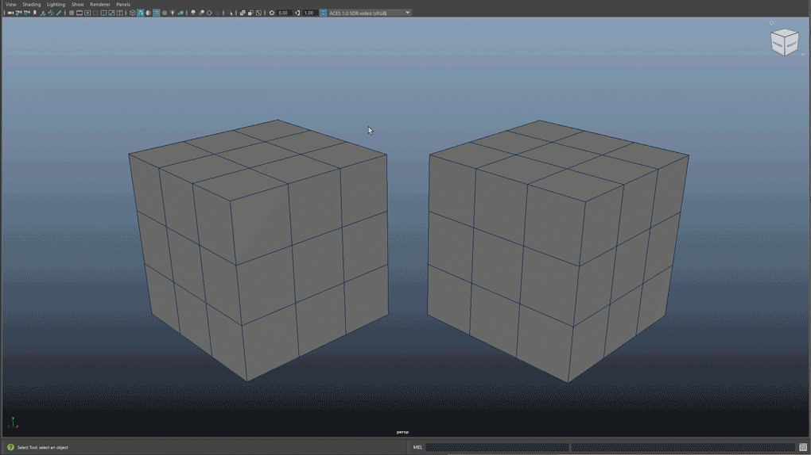
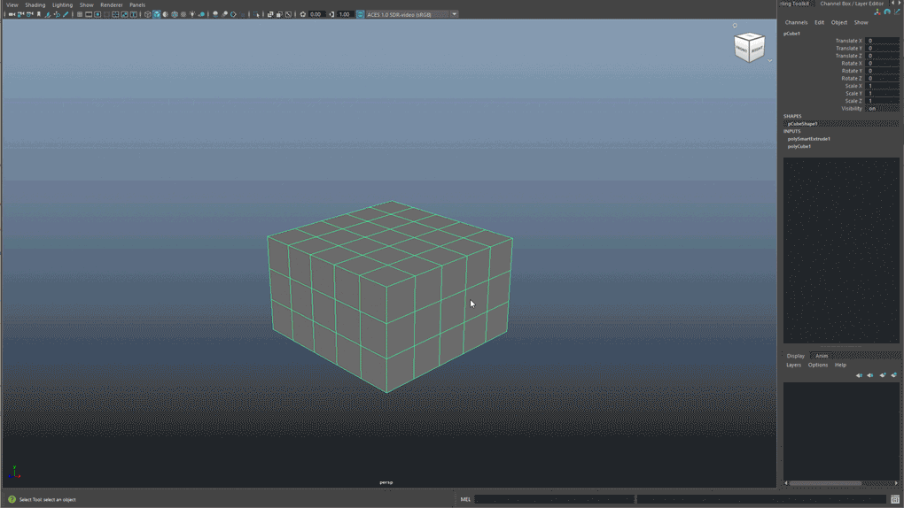
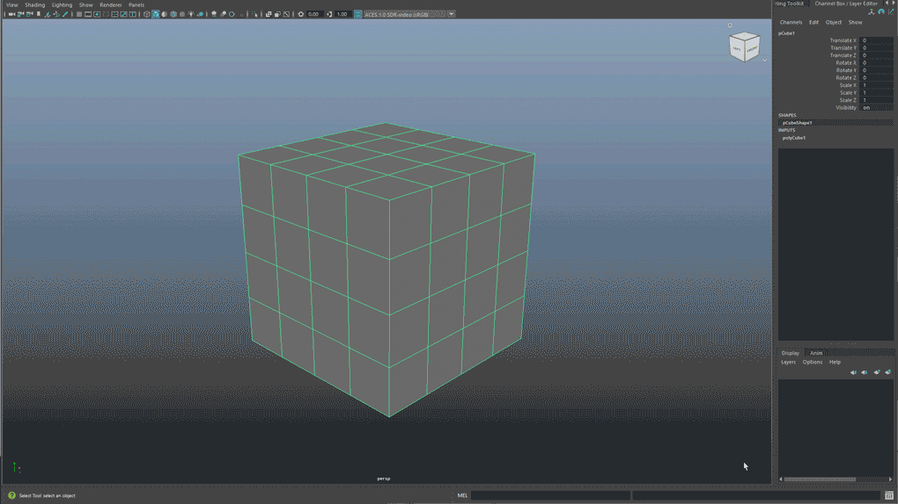
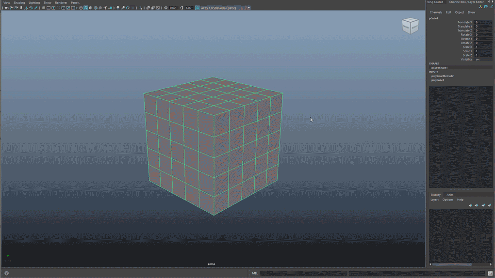
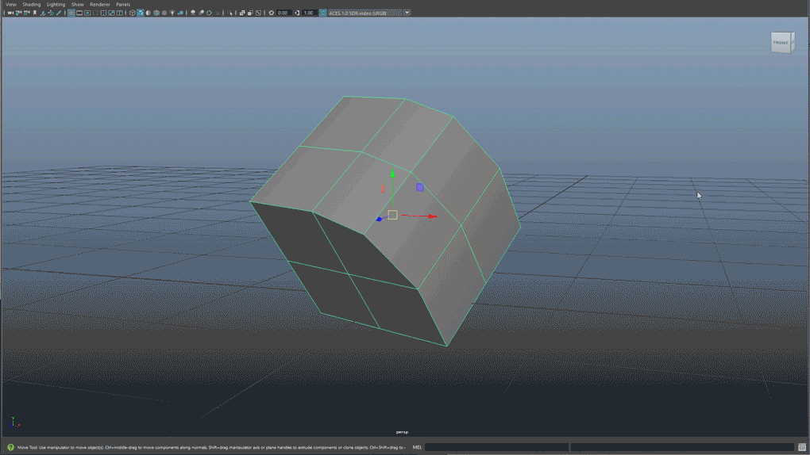

# 使用“智能挤出”(Smart Extrude)以交互方式操纵网格

## 在 Maya 中使用“智能挤出”(Smart Extrude)

**“智能挤出”(Smart Extrude)**是 Maya 的一项强大的新挤出功能，可用于在视口中以交互方式挤出面，而无需手动修复在传统“挤出”(Extrude)操作期间出现的双面和未焊接结果。利用**“智能挤出”(Smart Extrude)**，可以交互地重建和缝合被操作结果完全或部分切割或重叠的面，从而创建新的流形几何体，无需手动修复隐藏面或几何数据。因此，您可以自由地浏览和修改对象上的多边形网格拓扑。

要激活**“智能挤出”(Smart Extrude)**，请先在视口中进行面的组件选择。然后，选择**“编辑网格 > 智能挤出”(Edit Mesh > Smart Extrude)**，并使用操纵器在视口中拖动面。任何重叠的面都会自动缝合并重建到网格中，以获得干净的拓扑结果。

使用**“智能挤出”(Smart Extrude)**的提示：

1. 也可以使用多边形建模[工具架](https://help.autodesk.com/view/MAYAUL/2025/CHS/?guid=GUID-4A21F741-C9AC-4AE5-897E-B6F8C68ADF90)中的新按钮和图标以及用于以面为中心的建模操作的 Shift + 鼠标右键标记菜单，来访问“智能挤出”(Smart Extrude)。

2. 默认情况下，“智能挤出”(Smart Extrude)将与选定的组件选择对齐。要将它与另一个方向对齐，请使用“方向”(Orientation)标记菜单，可使用标准 Shift + Ctrl + 鼠标右键热键来访问该菜单。

3. 在运行**“智能挤出”(Smart Extrude)**后，G 热键将重复该操作。使用此方法可以依次运行多个“智能挤出”(Smart Extrude)操作。

4. “智能挤出”(Smart Extrude)操纵器有一个基本标记菜单，该菜单将基于以下选项自动设置

   “枢轴方向”(Pivot Orientation)

   ：

   - 设置为对象(Set to Object)
   - 设置为世界(Set to World)
   - 设置为组件(Set to Component)

5. 向外挤出可用于扩大或接合到其他现有几何体，而向内挤出用于雕刻到对象中。

6. 向内移动的“智能挤出”(Smart Extrude)可以应用于多个边分段，部分或完全进入/通过网格（包括角）。在这些情况下，几何体将被删除并在它们相交的位置被移除。

7. 如果尝试从“顶点”或“边”组件运行“智能挤出”(Smart Extrude)，则所选内容将转换为“面”组件，然后将应用“智能挤出”(Smart Extrude)。

8. 向外移动的“智能挤出”(Smart Extrude)选择将和与之相交的同一网格对象上的其他多边形数据接合并缝合在一起。

9. 如果需要未焊接的结果，请选择**“编辑网格 > 挤出”(Edit Mesh > Extrude)**以使用常规挤出实现。根据建模需要，在“智能挤出”(Smart Extrude)和“挤出”(Extrude)操作之间切换。

10. “智能挤出”操作的结果可以是自相交或跨网格对象的多个连续壳。生成的几何体仍将是干净的拓扑。

向内挤出面时，**“智能挤出”(Smart Extrude)**会切割并删除网格任何部分上的面，以允许结果完全延伸。生成的孔将重新缝合到周围的面。这类似于布尔差集 (A-B) 运算。将面向外挤出到网格上的其他面时，任何相交都会缝合在一起，以生成清晰的结果。这类似于布尔并集运算。

“智能挤出”(Smart Extrude)将挤出、剪切、合并和并集作为一体化操作完成。因此，其应用范围包括但不限于以下方面：

***与“挤出”(Extrude)相比，使用“智能挤出”(Smart Extrude)可减少手动清理次数\***

***无缝地合并和缝合面\***

***完成复杂的切割\***

***切割网格并更改切割的方向和方位\***

***切割以移除或结合部分网格\***

***使用操纵器更改枢轴方向\***

***提示：**您可以使用“移动”(Move)、“旋转”(Rotate)和“缩放”(Scale)工具的内置枢轴捕捉功能将枢轴对齐到任何边、顶点或面。然后，当激活“智能挤出”(Smart Extrude)时，它会自动继承该工具的枢轴方向。*

若要了解有关**智能挤出**和其他建模更新的详细信息，请通过提供反馈来参与开发，并加入 [Autodesk Beta 社区](https://feedback.autodesk.com/project/forum/topic.html?cap=037743fd817049f18d3a9e014e771fd6&forid={a8b14e0a-673b-43a9-82d2-920a55fc1181})。

**注意：**不要将新的“智能挤出”(Smart Extrude)功能与旧版“智能挤出”(Smart Extrude)功能（现在称为“Shift 挤出”(Shift Extrude)）相混淆。