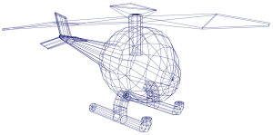
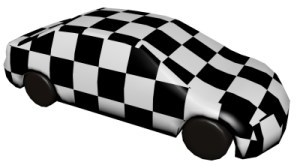
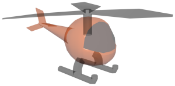
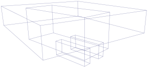

您可以更改用于确定 Maya 如何在视图面板中绘制所有几何对象的显示模式。

这些显示模式根据每个视图面板设置。因此，您可以在每个面板中显示不同的模式。但是，您可以根据需要在一个视图面板的“着色”(Shading)菜单中设置这些选项，然后选择“着色 > 将当前样式应用于所有对象”(Shading > Apply Current to All)，以便将当前视图面板中的设置应用于所有其他视图面板。

| 对象显示形式             |                                                              | 操作                                                         |
| :----------------------- | :----------------------------------------------------------- | :----------------------------------------------------------- |
| 线框(Wireframe)          |  | 按 4 键或单击面板工具栏中的  图标。或在视图面板中，选择“着色 > 线框”(Shading > Wireframe)。 |
| 着色(Shaded)             |  | 按 5 键或单击面板工具栏中的  图标。或选择“着色 > 对所有项目进行平滑着色处理”(Shading > Smooth Shade All)。您还可以选择“着色 > 对选定项目进行平滑着色处理”(Shading > Smooth Shade Selected Items)，以便仅对选定对象进行着色。 |
| 使用硬件渲染纹理进行着色 |  | 按 6 键或启用了“对所有项目进行平滑着色处理”(Smooth Shade All)时：单击面板工具栏中的  图标或选择“着色 > 硬件纹理”(Shading > Hardware Texturing) |
| 着色对象上的线框         |  | 启用了“对所有项目进行平滑着色处理”(Smooth Shade All)时：单击  图标或选择“着色 > 着色对象上的线框”(Shading > Wireframe on Shaded) |
| 默认材质                 |  | 启用了“对所有项目进行平滑着色处理”(Smooth Shade All)时：单击  图标或选择“着色 > 使用默认材质”(Shading > Use Default Material) |
| X 射线模式(X-Ray Mode)   |  | X 射线着色自动采用轻微透明度显示对象，以便您查看和选择不透明曲面后面的物体。有三种 X 射线显示模式：所有对象：单击  图标或选择“着色 > X 射线”(Shading > X-Ray)活动组件：单击  图标或选择“着色 > X 射线活动组件”(Shading > X-Ray Active Components)骨架关节：单击  图标或选择“着色 > X 射线关节”(Shading > X-Ray Joints)**提示：** 可使用 **Alt** + **A** 在所有这些模式之间切换。 |
| 边界框(Bounding Box)     |  | 选择“着色 > 边界框”(Shading > Bounding Box)                  |
| 平面（面状）着色         |  | 选择“着色 > 对所有项目进行平面着色”(Shading > Flat Shade All)或“对选定项目进行平面着色”(Flat Shade Selected Items) |
| 恒定着色                 |  | 选择“照明 > 使用平面照明”(Lighting > Use Flat Lighting)。您还可以启用“着色 > 着色对象上的线框”(Shading > Wireframe on Shaded)来查看对象上的几何体线框。 |