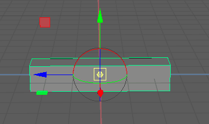
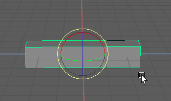
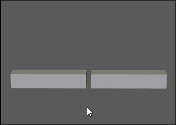
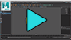
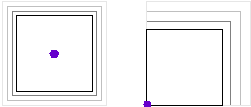
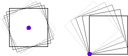
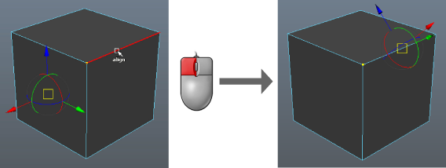
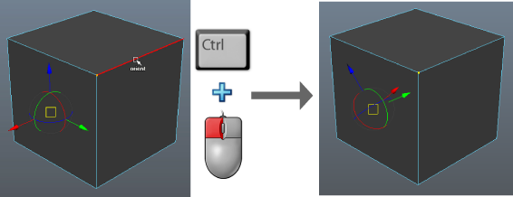
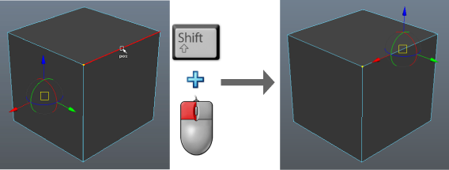
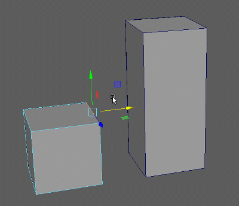

枢轴点定义对象或组件绕其旋转和缩放的位置。默认情况下，一个对象或一组对象/组件的枢轴点位于其中心。如果要将对象围绕特定点旋转（例如前臂围绕肘部旋转），您需要调整枢轴的位置。提供了两种方法：

## 使用“高度基线”(Height Baseline)重新定位枢轴

调整“高度基准线”(Height Baseline)将移动枢轴

默认情况下，每个多边形几何体对象的枢轴设置为几何体中心 (0)。**“高度基线”(Height Baseline)**属性可用于将其重新定位到对象的顶部 (-1) 或底部 (0)。

若要修改枢轴的位置，请执行下列操作之一：

1. - 在[属性编辑器(Attribute Editor)](https://help.autodesk.com/view/MAYAUL/2025/CHS/?guid=GUID-67A58D31-4722-4769-B3E6-1A35B5B53BED)的几何体选项卡（例如 polyCube1）中，更改**“高度基线”(Height Baseline)**设置。
   - 在[节点编辑器(Node Editor)](https://help.autodesk.com/view/MAYAUL/2025/CHS/?guid=GUID-23277302-6665-465F-8579-9BC734228F69)中，单击几何体节点（例如 polyCube1）的输出端口，然后选择**“高度基线”(Height Baseline)。**

   

## 使用“自定义枢轴”(Custom Pivot)模式重新定位枢轴

“自定义枢轴”(Custom Pivot)模式是另一种可用于设置对象和组件枢轴点的方法。

 [另请参见：调整对象的轴（视频）](https://www.youtube.com/watch?v=kmkYuxcuEt0)

| 变换                                                    | 与枢轴的关系                                                 |
| :------------------------------------------------------ | :----------------------------------------------------------- |
| 移动                                                    | 移动枢轴点（并且对象也随其一起移动）。                       |
| 缩放                                                    | 远离或接近枢轴点缩放对象 |
| 旋转(Rotation)                                          | 围绕枢轴点旋转对象。 |
| **提示：** 您可以通过按键盘上的 + 或 - 来更改枢轴尺寸。 |                                                              |

更改枢轴点

1. 选择要变换的对象或组件。

2. 选择[变换工具(transform tool)](https://help.autodesk.com/view/MAYAUL/2025/CHS/?guid=GUID-9622730D-3D21-451C-8BEE-E01BCC979F91)。

3. 通过执行以下操作之一进入

   “自定义枢轴”(Custom Pivot)

   模式：

   - 按 D 键（或按住该键）或 Insert 键。
   - 单击“工具设置”(Tool Settings)中的“编辑枢轴”(Edit Pivot)。

   将显示自定义枢轴操纵器（组合了平移和旋转操纵器）。如果您正在组件模式下建模，多组件选择模式将激活。

   **提示：** 使用[操纵器首选项(Manipulator preferences)](https://help.autodesk.com/view/MAYAUL/2025/CHS/?guid=GUID-8740471F-BD72-4BDC-87B4-4DE870AD51E5)中的“枢轴操纵器”(Pivot Manipulator)选项隐藏或调整自定义枢轴操纵器的方向控制柄。

4. 拖动或

   捕捉(snap)

   自定义枢轴操纵器以移动或旋转枢轴。

   您还可以使用以下工作流：

   - 单击组件以将枢轴捕捉和对齐到选定组件。

     

   - 按住 Ctrl 键并单击组件，将其轴方向捕捉到选定组件。

     

   - 按住 Shift 键并单击，将枢轴放置在光标处。如果按住 Shift 键并单击组件，则枢轴将捕捉到该组件。

     

     **提示：** 与标准建模一样，通过在“枢轴操纵器”(Pivot Manipulator)中单击相应的轴控制柄，可以将移动约束到特定方向。

   - 同时按住 Ctrl 和 Shift 键并在对象中单击，将枢轴对准鼠标光标。如果同时按住 Ctrl 和 Shift 键并单击特定枢轴，将发生以下情况：

     - 如果选择了中心控制柄或 X 轴控制柄，则自定义枢轴在选定组件上确定其 X 轴。
     - 如果选择了 Y 轴控制柄，则自定义枢轴在选定组件上确定其 Y 轴。
     - 如果选择了 Z 轴控制柄，则自定义枢轴在选定组件上确定其 Z 轴。

   - 

      

     按住 C 或 V 键并使用鼠标中键拖动另一个对象，以将枢轴分别捕捉到该对象的边或顶点。如果要快速将一个对象中的组件对齐到另一个对象，这很有用。

     

5. 通过重复步骤 4 退出“自定义枢轴”(Custom Pivot)模式。

**注：** 在“自定义枢轴”(Custom Pivot)模式下切换工具或单击不同的对象时，自定义枢轴将会保留。

通过在场景上单击鼠标右键并选择任一“重置枢轴”(Reset Pivot)选项，您可以随时重置已修改的枢轴的位置/方向（仅在“自定义枢轴”(Custom Pivot)模式下）。

**注：** 也可以通过[“修改 > 烘焙枢轴”(Modify > Bake Pivot)](https://help.autodesk.com/view/MAYAUL/2025/CHS/?guid=GUID-378D7FF6-492F-4DA4-A468-507E6ABF8B58)将自定义枢轴烘焙到各自的对象。

除了使用“自定义枢轴”(Custom Pivot)模式之外，您还可以通过在属性编辑器中输入精确值来定位对象的枢轴。

使用精确值重新定位对象的枢轴

1. 打开“属性编辑器”(Attribute Editor)并单击变换节点的选项卡。
2. 在“枢轴”(Pivots)部分启用枢轴显示选项，这样就可以看到编辑枢轴值所产生的效果。
3. 执行下列操作之一：
   - 在“局部空间”(Local Space)部分，相对于对象的原点为“旋转枢轴”(Rotate Pivot)和“缩放枢轴”(Scale Pivot)键入 X、Y 和 Z 坐标。
   - 在“世界空间”(World Space)部分，相对于世界原点为“旋转枢轴”(Rotate Pivot)和“缩放枢轴”(Scale Pivot)键入 X、Y 和 Z 坐标。