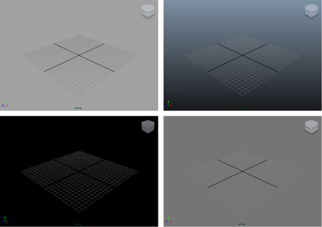
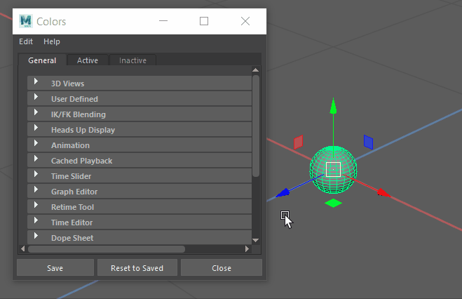

通过按 Alt+B，可以快速在视图面板中的不同背景色之间切换。

您还可以设置首选项来更改默认背景。

## 设置自定义背景颜色

1. 选择“窗口 > 设置/首选项 > 颜色设置”(Windows > Settings/Preferences > Color Settings)。
2. 在出现的“颜色”(Colors)窗口中，选择“常规”(General)选项卡并展开“3D 视图”(3D Views)区域。
3. 执行下列操作之一：
   - 若要更改默认背景色，请单击“背景”(Background)色样或调整滑块。
   - 若要更改渐变背景色，请单击“渐变顶部”(Gradient Top)和“渐变底部”(Gradient Bottom)色样或调整滑块。

启用或禁用渐变背景

1. 选择“窗口 > 设置/首选项 > 首选项”(Window > Settings/Preferences > Preferences)。
2. 在出现的“首选项”(Preferences)窗口中，选择“显示”(Display)类别。
3. 在“视图”(View)区域中，对“背景渐变”(Background Gradient)选择“启用”(on)或“禁用”(off)。