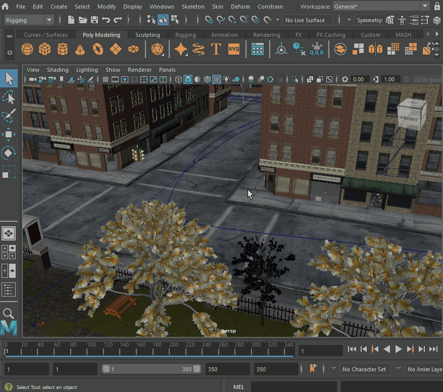

按 Ctrl+Shift 切换到全屏模式

全屏模式可以最大化 Maya 的工作区，从而使 Maya 在更小的屏幕上更易于使用。启用了全屏模式后，标题栏、菜单栏以及固定窗口都将被隐藏。

**注：** 如果您使用的是 Mac OS，则此步骤会有所不同。若要在 Mac 上进入全屏模式，请参见[进入全屏模式 (macOS)](https://help.autodesk.com/view/MAYAUL/2025/CHS/?guid=GUID-0D243859-3B75-425C-BEF7-86B5F05932B1)。

在 Windows 上进入全屏模式

1. 在 Maya 中，按 **Ctrl**+**空格键**以在当前[视图面板(View panels)](https://help.autodesk.com/view/MAYAUL/2025/CHS/?guid=GUID-455539A6-3506-458C-92DA-14F171C14553)的默认视图和全屏视图之间切换。

在 Windows 上退出全屏模式

1. 再次按 **Ctrl**+**空格键**。

**提示：** 若要显示或隐藏[视图面板(View panels)](https://help.autodesk.com/view/MAYAUL/2025/CHS/?guid=GUID-455539A6-3506-458C-92DA-14F171C14553)菜单，请按 **Shift**+**M**。