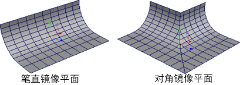
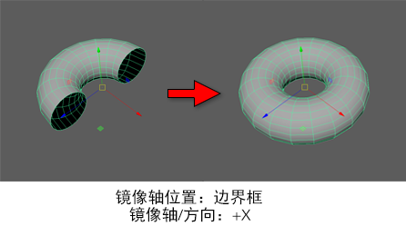
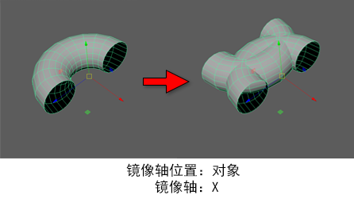
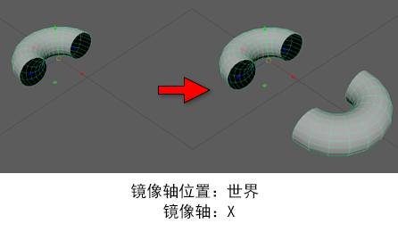
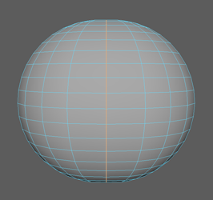

“镜像”(Mirror)命令可用于为不可见镜像平面中反射的网格创建副本。然后，您可以手动定位此平面，以自定义和调整生成的几何体。使用以下选项可设置选择“网格 > 镜像”(Mesh > Mirror)时发生的情况。

## 镜像设置(Mirror Settings)

- 切割几何体(Cut Geometry)

  确定是否从网格中移除断开切割平面的面。

- 几何体类型(Geometry Type)

  指定使用“镜像”(Mirror)命令时 Maya 生成的网格类型。默认值为“复制”(Copy)。

- 复制(Copy)

  当“与原始对象组合”(Combine with Original)处于禁用状态时，创建未链接到原始几何体的新对象。如果启用“与原始对象组合”(Combine with Original)，此选项将创建镜像组件的新壳，使其成为原始对象的一部分。

- 实例(Instance)

  创建要被镜像的几何体实例。创建实例时，并不是创建选定几何体的实际副本。相反，Maya 会重新显示实例化的几何体。

- 翻转(Flip)

  沿“镜像轴”(Mirror Axis)重新定位选定几何体。这等同于用对象相应的比例属性乘以 -1。

- 镜像轴位置(Mirror Axis Position)

  指定要镜像选定多边形对象的对称平面。默认值为“世界”(World)。

- 边界框(Bounding box)

  相对于包含选定对象的不可见立方体的一侧镜像。

- 对象(Object)

  相对于选定对象的中心镜像。

- 世界(World)

  相对于世界空间的原点镜像。

- 镜像轴(Mirror Axis)

  指定要镜像选定多边形对象的轴，以“镜像轴位置”(Mirror Axis Position)为中心。默认值为 X。

- 镜像方向(Mirror Direction)

  指定在“镜像轴(Mirror Axis)”上镜像选定多边形对象的方向。默认值为正方向。

## 合并设置(Merge Settings)

- 与原始对象组合(Combine with Original)

  将原始对象和镜像对象组合到单个网格中。因此，您对原始对象所做的后续更改不会应用到镜像对象。默认设置为启用。

- 边界(Border)

  指定如何将镜像组件接合到原始多边形网格。默认值为“合并边界顶点”(Merge border vertices)。

- 合并边界顶点(Merge border vertices)

  根据“合并阈值”(Merge Threshold)沿边界边合并顶点。

- 桥接边界边(Bridge border edges)

  创建新面，用于桥接原始几何体与镜像几何体之间的边界边。

- 不合并边界(Do not merge borders)

  单独保留原始几何体组件和镜像几何体组件。

- 合并阈值(Merge Threshold)

  当“边界”(Border)设置为“合并边界顶点”(Merge border vertices)时，指定合并顶点的方法。默认值为“自动”(Automatic)。

- 自动(Automatic)

  将顶点的逻辑对（即：每个顶点及其镜像）合并到两个顶点之间的中心点。仅当顶点彼此位于由平均边界边长度的分数确定的特定距离阈值内（使其保持比例独立）时，才会合并顶点。

- 自定义(Custom)

  合并位于所设阈值（以场景单位表示）内的顶点。

- 平滑角度(Smoothing angle)

  将软化原始对象与副本之间的对称线上边界面形成的角度小于或等于“平滑角度”(Smoothing Angle)的边。否则，它们保持为硬边。默认值为 30。

### UV 设置(UV Settings)

- 翻转 UV (Flip UVs)

  在指定的“方向”(Direction)上翻转 UV 副本或选定对象的 UV 壳，具体取决于当前的“几何体类型”(Geometry Type)。默认为关闭。

- 方向(Direction)

  当“翻转 UV”(Flip UVs)处于启用状态时，指定在 UV 空间中翻转 UV 壳的方向。默认值为“局部 U 向”(Local U)。