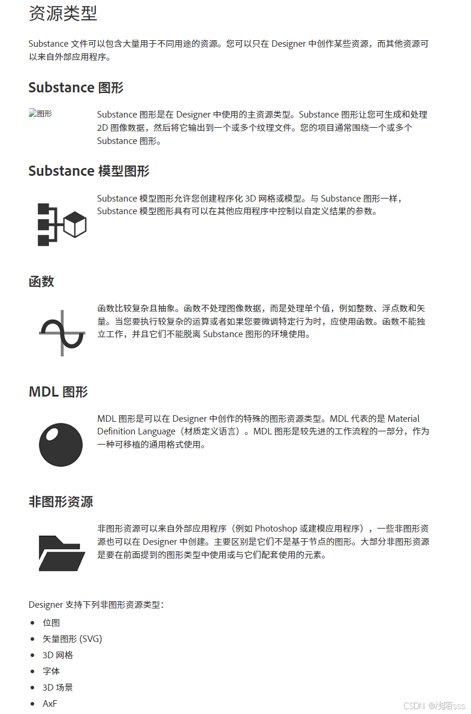

**1.主菜单栏：**
  **File：**

**Tools：**
可调整 Substance Engine 选项。Substance Engine 是计算 Substance 图形的进程。在工具菜 单中，您可以暂停、重置和调整 Engine 的设置。工具菜单还让您可访问插件管理器。

**Windows:**
管理组成 Designer 界面的窗口,可以打开新窗口、切换个别窗口可见性或使用窗口 > 重置布局来让 Designer 恢复到其默认状态。

**Help:**
可以访问各种资源，例如 Designer 的文档、教程和发行说明。您还可以向我们发送反馈意见和报告错误，或者找到有关许可和版本的更多信息。

**2.浏览器面板：**管理包和资源

包右键管理器菜单显示如下：

**3.节点图编辑面板：**创建基于节点的图形
包含两个不同的区域：工具栏和显示区域。

**4.属性面板：**修改上下文相关属性

**5.库面板：**查找图形资源

**6.3D视图面板：**与完整材质交互的3D预览

**7.2D视图面板：**获得上下文相关的图像预览

### 2.核心概念：

###   

[核心概念 (adobe.com)https://helpx.adobe.com/cn/substance-3d-designer/using/core-concepts.html](https://helpx.adobe.com/cn/substance-3d-designer/using/core-concepts.html)